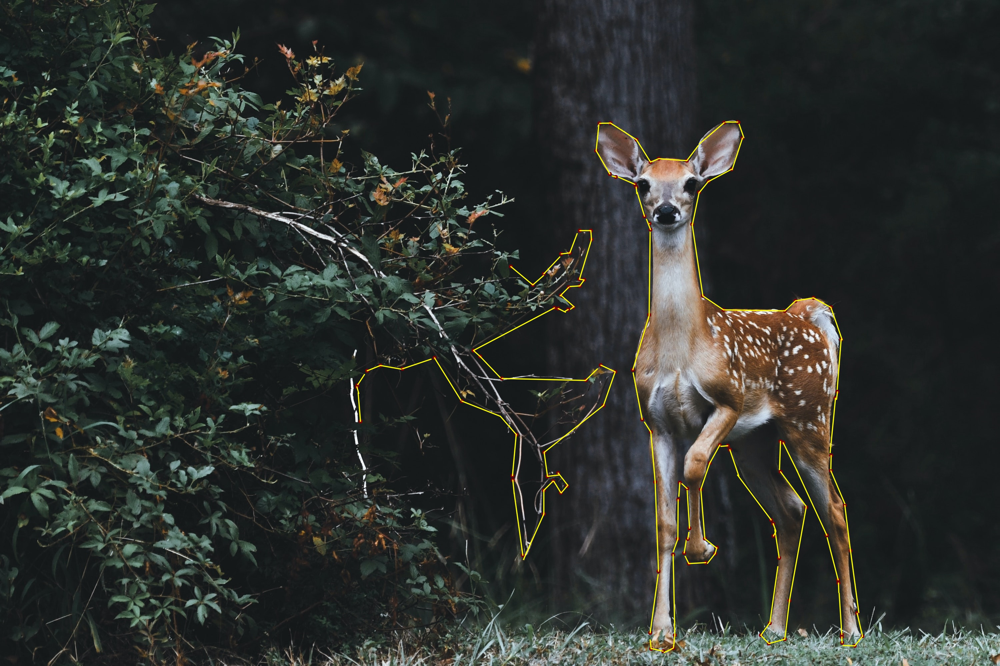

# Segmanta

[](github)
[](github)
[](github)

<desc> 💼 Segmanta is an Image Segmentation Tool - IIST </desc>

## 📌 Table of Contents

- [Table of Contents](#-table-of-contents)
- [Project Structure](#️-project-structure)
- [Project Description](#-project-description)
- [How to Use the Tool - Usage](#-how-to-use-the-tool---usage)
- [Features](#-features)
- [Dependencies](#-dependencies)
- [Result Examples](#-result-examples)
- [References](#-references)
- [To-Do](#-to-do)
- [License](#-license)
- [Contact](#-contact)

## 🏗️ Project Structure

The project is structured as follows:

```
|───.vscode
|───tests
|   ├───test_annotation.py
|   ├───test_file.py
|   └───test_model.py
├───src
│   ├───__pycache__
│   └───data
│       ├───annotated_images
│       └───standard_test_images
|   └───prev_source_code_folder
│       └───main_prev.py
|   └───result_images
|   └───utils
│       ├───annotation_utils.py
│       ├───file_utils.py
│       └───model_utils.py
│   └───main.py
├───.gitignore
├───LICENSE.md
├───README.md
└───requirements.txt
```

## 📝 Project Description

This is an Interactive Image Segmentation Tool that allows users to segment and annotate objects in images based on their semantic measurments. This tool is built using OpenCV and Python. Using this tool, users can segment images using freehand drawing, polygon selection, and rectangle selection. And then, users can assign semantic labels to the regions of interest (ROI) that they have defined. Once your run the project, you will be able to seelect an image from your saple images directory and segment it using one of the three methods mentioned above. As you segment the image using one of the methods, you will be able to see the results in window view of OpenCV. Also users can view annotated images in gallery view and save them to their local machine. The tool also allows users to annotate images using pretrained models. **The tool is being built using OpenCV and Python** and is still under development.

## 📌 How to Use the Tool - Usage

1. Clone the repository to your local machine using the following command:

```bash
git clone https://github.com/Sardor-M/Segmanta.git
```

2. Install all the dependencies using the following command:

```bash
pip install -r requirements.txt
```

3. Run the program using the following command:

```bash
cd src
python main.py
```

4. Once you run the program, you will be able to see the pop-up asks you to enter **1** and choose the sample image that you want to segment.

- **Note that you can add your own images to the sample images directory and segment them using the tool.**

5. Once you choose the image, you will be able to see the pop-up asks you to enter **2** and choose the method that you want to use to segment the image.

- **Note that you can segment the image using one of the three methods:**
  - **Freehand Drawing Mode**
  - **Polygon Selection Drawing Mode**
  - **Rectangle Selection Mode**

#### Below are the command input characters that you can use to switch between the modes and do some other operations:

| Modes                               | Cmd   |
| ----------------------------------- | ----- |
| Freehand Drawing Mode               | **f** |
| Polygon Selection Drawing Mode      | **p** |
| Save Segmented Image Cmd            | **s** |
| <del>Rectangle Selection Mode</del> | **r** |
| <del>Edit the label for ROI</del>   | **l** |
| View Gallery Mode                   | **q** |
| Exit Program Cmd                    | **e** |

##

## 🔐 Features:

- [x] **Freehand Drawing**
- [x] **Polygon Selection Drawing**
- [x] <del> Rectangle Selection </del>
  - **This has to be fixed, not working as expected**
- [x] <del> Define ROIs around objects </del>
- [x] **Assign semantic labels to ROIs**
  - **This has to be fixed, not working as expected**
- [x] **View Annotated Imaages in Gallery View**
  - **This feature is implemented, but needs more work and improvement**
- [x] **Manual Mask Visualization Mode**
  - **This feature is implemented, but needs improvement and work.**
  - **Also needs to update the functionality  that enable manual mouse masking method**
- [x] **Save Annotated Images to Local Machine**

## 📦 Dependencies

The following dependencies are required to run the program:

- [Python 3.8.5](https://www.python.org/downloads/release/python-385/)
- [OpenCV 4.5.1](https://opencv.org/)
- [Numpy 1.19.2](https://numpy.org/)
- [Pytorch 1.7.1](https://pytorch.org/)
- [Pillow 8.1.0](https://pillow.readthedocs.io/en/stable/)
- [Torchvision 0.8.2](https://pypi.org/project/torchvision/)
- [Transformers 4.3.3](https://pypi.org/project/transformers/)

## 📷 Result Examples:

### Freehand Drawing Mode: 

|   Freehand Drawing Mode     |          Polygon Selection Drawing Mode          |
| :-----------------: | :---------------------------------------: |
|  |  |

### 📝 Note:

> The following modes functionality use case result examples are not presented. Those are 
  -  **Recatanlge Selection Mode** 
  - **Edit the label for ROI**
  - **Label the ROI functionality**
  - **Manual Mask Vizualization Mode** 
> These functionalities are not working as expected and needs more work and time, when i get the chance, i will fix them and update the result examples in the further commits.

### Polygon Selection Drawing Mode on Empty Sheet:

- **As you run the project on your local machine, you can also see and play around with the **Simple Polygonal Drawing Window** on a new window, not on the surface of the image.**

 This is demonstration of the **Polygonal Drawing on Empty Window**:

 |   Polygonal Drawing on Empty Sheet    |         [Result] Polygonal Drawing on Empty Sheet         |
| :-----------------: | :---------------------------------------: |
|  |  |


## 📚 References

- [OpenCV](https://opencv.org/)
- [Computer Vision Tutorials](https://github.com/mint-lab/cv_tutorial)
- [Introduction to Semantic Image Segmentation](https://medium.com/analytics-vidhya/introduction-to-semantic-image-segmentation-856cda5e5de8)
- [Image Segmentation using OpenCv](https://nayakpplaban.medium.com/image-segmentation-using-opencv-39013013920a)
- [Semantic Segmentation](https://www.jeremyjordan.me/semantic-segmentation/)

## 📌 TODO

> Note that below To Do list is not intended to be exhaustive. It is just a list of features that I would like to implement in the future.

- [ ] **Annotate Images using Pre-Trained Models:**
  - As of now, pretrained model method is defined, but needs more imporvement. It will be implemented in the future.
- [ ] **Fix Rectangle Selection:**
  - The current version of the program does not allow users to select ROIs using a rectangle. This feature has to be fixed.
- [ ] **Fix Semantic Label Assignment:**
  - The current version of the program does not allow users to assign semantic labels to ROIs. This feature has to be fixed.
- [ ] **Real Time Image Segmentation:**
  - The current version of the program only allows users to segment images that are already stored on their local machine.
  - In the future, I would like to implement a feature that allows users to segment images in real time using their webcam.
- [ ] **Active Learning for Semantic Segmentation:**
  - This includes implementing an active learning approach where the toll learns from the user's annotations and provides suggestions for the next best annotation to be made.
- [ ] **Implementing a Web App and Integrating the GUI that allows users to interact with Semantic Image Segmentation Tool:**
  - I would like to implement a web app that allows users to segment images online.
  - This will allow users to segment images without having to install the program on their local machine.
  - This will also allow users to share their annotations with other users.

## 📝 License

> This project is licensed under the MIT License - see the [LICENSE.md](LICENSE.md) file for details

## ✉️ Contact

> Feel free to contribute, fork or star or if you have any questions or suggestions please contact me.
>
> - **sardor0968@gmail.com**


